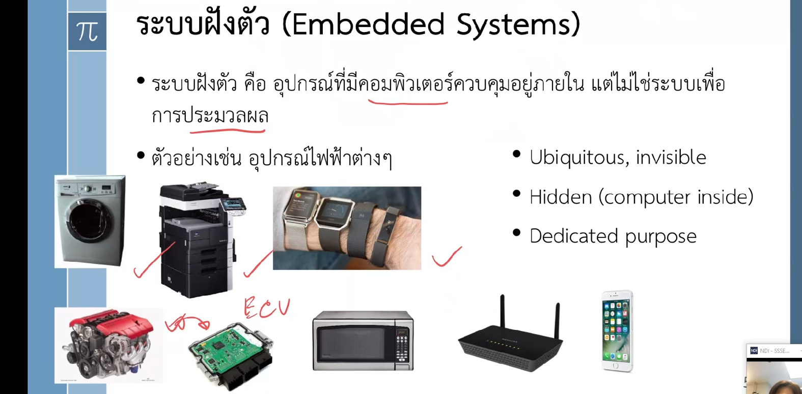

# MICROCONTROLLER APPLICATION AND DEVELOPMENT

## Lec00 + Lec01

Course Description


Score Base (PBL สำคัญ)


แนะนำช่องไว้เป็นแนวทาง (อาจารย์แนะนำ Web learning มากๆ)


Past Assignment (ไว้ดูเป็นแรงบันดาลใจ)

```bash
https://docs.google.com/spreadsheets/u/1/d/1dXI0XMw6Xk0SFb2YWd1tNQwKYCbWxXydL8E8IzinDNo/htmlview
```

## How do they differ?

ของทันสมัยจะมี Computer Embedded อยู่ เรียก Embedded Systems




คุณสมบัติของระบบฝังตัวมี 3 ข้อตามภาพ

- มีอยู่แพร่หลาย
- มีคอมพิวเตอร์ซ่อนอยู่
- มีจุดประสงค์ที่ชัดเจน


Control Systems

- แบบ Open Loop (ต้อง Calibrate สร้างง่าย ไม่แม่นยำ)
- แบบ Close Loop (มีการวัด Output ทำได้จริงหรือไม่แล้วปรับ)


## Microprocessor


Microcontroller


คุยด้วย Bus มี 3 แบบตามรูปข้างบน (ตัวแดง)

## Language


RTOS (Real Time Operating System)
ไล่จากระดับต่ำไปสูง


Compiler


สรุป


