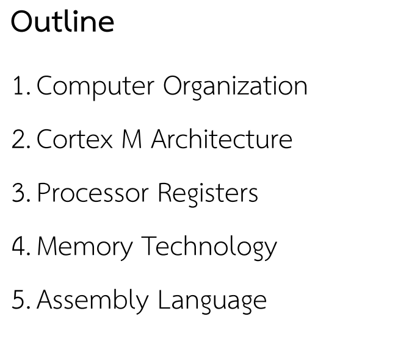

# MICROCONTROLLER APPLICATION AND DEVELOPMENT

## Lec02

Outline

ขั้นตอนการ Dev

ดูในรูปด้านบนขวาดีๆ

สองรูปบนสำคัญมาก

Von Neumann จะ Share instructtion/data bus เลยทำได้อย่างใดอย่างหนึ่ง

ดูรูปด้านบนดีๆ

สิ่งที่ไมโครคอนต้องมีถึงจะเรียกไมโครคอน

MMU (Memory Management Unit)
MPU (Memory Protection Unit)

ดูบัสในรูปบนดีๆ อาจารย์พูดเยอะมาก

AHB (Advance High Performance Bus) เร็วกว่า

APB มี่ 2 ชุด (Advance Peripheral Bus)

ไว้จัดการจราจร

ดูรูปบนดีๆ

ดู 4 bits นี้ดีๆ

อ่าน PROM,EPROM,EEPROM มาด้วย

ดูด้วยว่าชนิดไหนทำมาจากอะไร

ดูคุณสมบัติมาดีๆ
